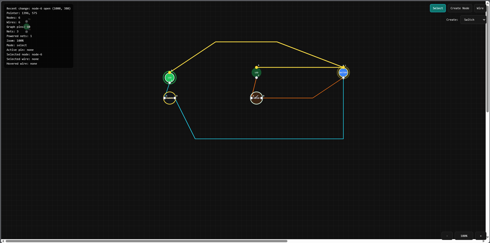
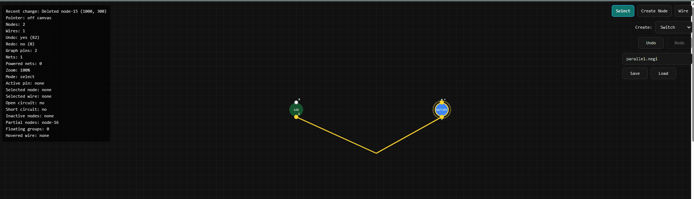

# Negi-Lab

Negi-Lab is an open-source browser-based circuit editor built on a real-time graph engine, designed for interactive circuit creation, visual logic propagation, and portable `.negi` circuit files.





---

## ⚡ What is Negi-Lab?

Negi-Lab is not just a circuit simulator.

It is a graph-powered visual circuit design platform where:

- Components are nodes
- Wires create graph connections
- Nets propagate power states in real time
- Circuits are saved in portable `.negi` format

---

## 🚀 Current Features (v0.1)

### Core Editor
- Interactive node-based circuit editor
- Select / Create / Wire modes
- Grid-based canvas workspace
- Zoom and pan support
- Live hover inspector for components and wires

### Components Supported
- Battery
- LED
- Switch
- Button
- Resistor

### Logic Engine
- Real-time power propagation
- Powered net detection
- LED ON/OFF state logic
- Switch OPEN/CLOSED state logic
- Hover readouts for current and voltage values when available

### File System
- Save circuits as `.negi`
- Load `.negi` files
- Example circuit library included

### Hover Inspector
- Centralized `hoveredEntity` UI state for wires and nodes
- Floating tooltip near the cursor
- Component metadata display: type and id
- Live circuit readouts for resistor, LED, battery, switch, and button components
- Missing simulation values fall back to `--` without changing the simulation engine

---

## 📁 Example Circuits

Located in `/Examples`

- `intro.negi`
- `intro_complex.negi`
- `parallel.negi`

These demonstrate:

- Basic LED circuit
- Multi-switch layouts
- Parallel wiring structures

---

## 🧠 The .negi File Format

Negi-Lab introduces:

### `.negi`

A portable open circuit design format for graph-based circuit systems.

See full specification here:

👉 [FILE_FORMAT.md](./FILE_FORMAT.md)

---

## 🛠 Installation

Clone repository:

```bash
git clone https://github.com/SMRockies/Negi-Lab.git
cd Negi-Lab
npm install
npm run dev
